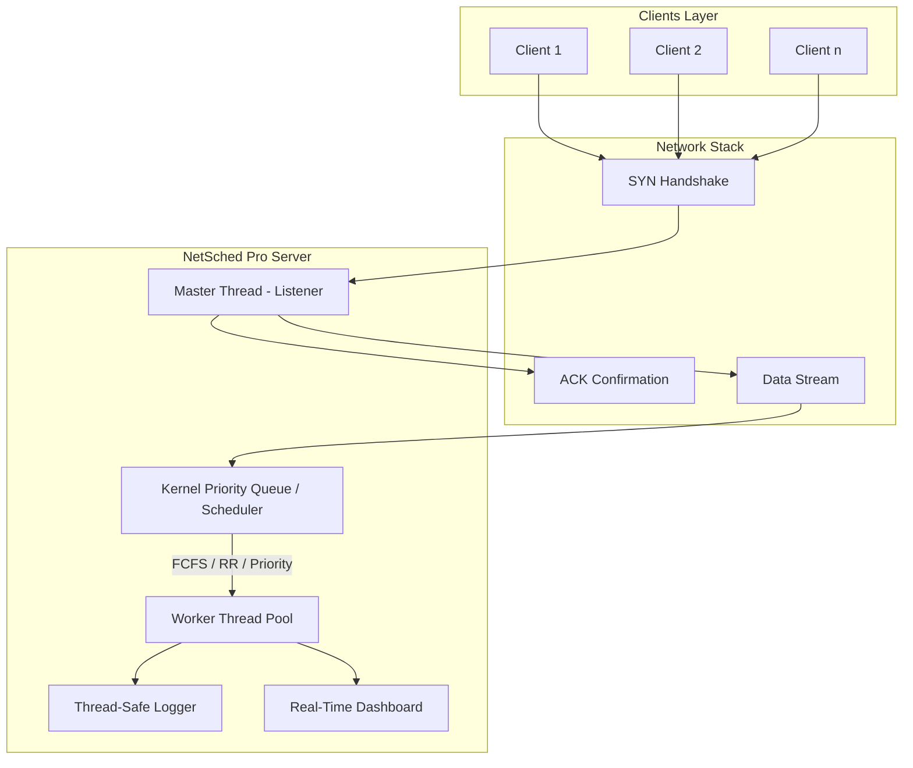

# 🌐 NetSched Pro: High-Concurrency OS & Network Simulation Engine

> **"Experience real-world server-client dynamics through the lens of OS scheduling and network protocol simulation."**

NetSched Pro is a high-performance simulation engine designed to demonstrate the critical interplay between Operating System (OS) CPU scheduling and real-world network communications. It bridges the gap between laboratory algorithms and production-grade server architectures.

---

## 🏗️ Architecture Diagram

---

## 🚀 System Workflow

1.  **Handshake Phase**: Clients initiate a 3-way handshake simulation (`SYN` -> `ACK`).
2.  **Request Encapsulation**: Application-layer methods (`GET`, `POST`, `DELETE`) are parsed into a `ServerTask`.
3.  **Kernel Queuing**: Tasks enter the **Ready Queue**. If the queue size exceeds `MAX_QUEUE_SIZE`, the system triggers an **Overload Protection Recovery** (`503 Service Unavailable`).
4.  **Strategic Scheduling**:
    *   **FCFS**: Standard sequential processing.
    *   **Round Robin**: Time-sliced execution for fairness.
    *   **Priority**: High-precedence requests bypass the queue based on their priority score.
5.  **Execution & Response**: Worker threads simulate task bursts and return a status code (`200 OK`, `500 ERR`).

---

## 🛠️ Debugging & Diagnostics Guide

The engine provides granular telemetry in `server_log.txt`:

*   **[SYN]/[ACK] Logs**: Verify if the network stack is accepting connections.
*   **[DATA_RECV] Logs**: Inspect incoming HTTP-like methods and URI paths.
*   **[RESPONSE] Logs**: Correlate request IDs with status codes and processing delays.
*   **[OVERLOAD] Warnings**: Identify the exact point of system saturation.

---

## 📉 Failure Case Examples

| Failure Mode | HTTP Status | Simulation Cause | Handling Logic |
| :--- | :--- | :--- | :--- |
| **Network Failure** | `500` | Probabilistic packet loss. | Logs error, notifies client, releases worker. |
| **Server Overload** | `503` | Incoming request rate > Worker capacity. | Rejects at the listener layer to protect the kernel. |
| **Gateway Timeout**| `504` | Task burst exceeding wait threshold. | Client-side timeout detection. |

---

## 📊 Performance Comparison

Users can benchmark algorithms using `run_compare.bat`. Typical findings:

*   **Round Robin**: Best for **Fairness** and reducing **Starvation**, but has higher overall context-switching overhead.
*   **Priority**: Best for **Critical Tasks** (e.g., `/api/admin/deploy`) but can lead to long wait times for low-priority requests.
*   **FCFS**: Simplest implementation; predictable but prone to the **Convoy Effect**.

---

## ⚠️ Limitations

*   **OS Dependency**: Currently restricted to Windows due to high-performance Win32 API requirements (Winsock, Critical Sections).
*   **Payload Size**: Simulations use fixed-size payloads for high throughput; dynamic byte-stream support is not yet implemented.
*   **Scaling**: The simulator is optimized for local loopback (`127.0.0.1`); external network jitter may vary based on OS environment.

---

## 🖥️ How to Run

1.  **Clone the Repository**.
2.  **Open PowerShell** in the `/Simulator` directory.
3.  **Build**: `.\build.bat`
4.  **Run Simulation**: `.\run_compare.bat`
5.  **Monitor**: View the live terminal dashboard for real-time success metrics.

---

© 2026 NetSched Pro - Built for Systems Engineering Professionals.
